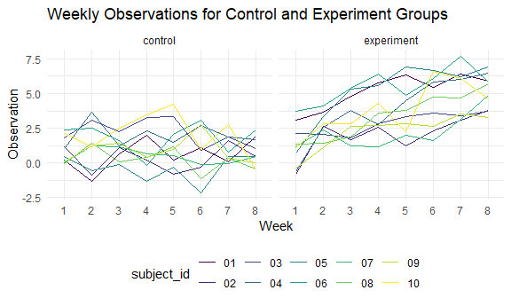

P8105 HW5
================
JingYao Geng
2020-11-12

## Problem 1

**Read in the homicide dataset.**

``` r
homicide_df = 
  read_csv("data1/homicide-data.csv")  
```

    ## Parsed with column specification:
    ## cols(
    ##   uid = col_character(),
    ##   reported_date = col_double(),
    ##   victim_last = col_character(),
    ##   victim_first = col_character(),
    ##   victim_race = col_character(),
    ##   victim_age = col_character(),
    ##   victim_sex = col_character(),
    ##   city = col_character(),
    ##   state = col_character(),
    ##   lat = col_double(),
    ##   lon = col_double(),
    ##   disposition = col_character()
    ## )

The original homicide data contains 52179 observations and 12 variables.
The variables are including information about the location (latitude and
longitude) of the homicide and the victim (first and last name, age,
sex, race).

**Create variable `city_state`**

``` r
homicide_df =
  homicide_df %>% 
  mutate(
    city_state = str_c(city, state, sep = "_"),
    resolved = case_when(
      disposition == "Closed without arrest" ~ "unsolved",
      disposition == "Open/No arrest"        ~ "unsolved",
      disposition == "Closed by arrest"      ~ "solved",
    )
  ) %>% 
  select(city_state, resolved) %>% 
  filter(city_state != "Tulsa_AL")
```

**Summarize within cities to obtain the total number of homicides and
the number of unsolved homicides**

``` r
aggregate_df = 
  homicide_df %>% 
  group_by(city_state) %>% 
  summarize(
    hom_total = n(),
    hom_unsolved = sum(resolved == "unsolved")
  )
```

    ## `summarise()` ungrouping output (override with `.groups` argument)

**For the city of Baltimore, MD, use the prop.test function to estimate
the proportion of homicides that are unsolved; save the output of
prop.test as an R object, apply the broom::tidy to this object and pull
the estimated proportion and confidence intervals from the resulting
tidy dataframe.**

``` r
prop.test(
  aggregate_df %>% filter(city_state == "Baltimore_MD") %>% pull(hom_unsolved), 
  aggregate_df %>% filter(city_state == "Baltimore_MD") %>% pull(hom_total)) %>% 
  broom::tidy()
```

    ## # A tibble: 1 x 8
    ##   estimate statistic  p.value parameter conf.low conf.high method    alternative
    ##      <dbl>     <dbl>    <dbl>     <int>    <dbl>     <dbl> <chr>     <chr>      
    ## 1    0.646      239. 6.46e-54         1    0.628     0.663 1-sample~ two.sided

**Now run prop.test for each of the cities in your dataset, and extract
both the proportion of unsolved homicides and the confidence interval
for each. Do this within a “tidy” pipeline, making use of purrr::map,
purrr::map2, list columns and unnest as necessary to create a tidy
dataframe with estimated proportions and CIs for each city.**

``` r
results_df = 
  aggregate_df %>% 
  mutate(
    prop_tests = map2(.x = hom_unsolved, .y = hom_total, ~prop.test(x = .x, n = .y)),
    tidy_tests = map(.x = prop_tests, ~broom::tidy(.x))
  ) %>% 
  select(-prop_tests) %>% 
  unnest(tidy_tests) %>% 
  select(city_state, estimate, conf.low, conf.high)
```

**Create a plot that shows the estimates and CIs for each city – check
out geom\_errorbar for a way to add error bars based on the upper and
lower limits. Organize cities according to the proportion of unsolved
homicides**

``` r
results_df %>% 
  mutate(city_state = fct_reorder(city_state, estimate)) %>% 
  ggplot(aes(x = city_state, y = estimate)) +
  geom_point() + 
  geom_errorbar(aes(ymin = conf.low, ymax = conf.high)) + 
  theme(axis.text.x = element_text(angle = 90, vjust = 0.5, hjust = 1))
```


**Alternative way with function**

``` r
city_prop_test = function(df) {
  
  n_unsovled ...
  n_total ... 
  
  prop.test(.....)
  
}
homicide_df = 
  read_csv("data/homicide-data.csv") %>% 
  mutate(
    city_state = str_c(city, state, sep = "_"),
    resolved = case_when(
      disposition == "Closed without arrest" ~ "unsolved",
      disposition == "Open/No arrest"        ~ "unsolved",
      disposition == "Closed by arrest"      ~ "solved",
    )
  ) %>% 
  select(city_state, resolved) %>% 
  filter(city_state != "Tulsa_AL") %>% 
  nest(data = resolved)
```

## Problem 2

A longitudinal study that included a control arm and an experimental
arm. Data for each participant is included in a separate file, and file
names include the subject ID and arm.

**Read in the data and tidy the dataframe containing data from all
participants, including the subject ID, arm, and observations over
time**

``` r
files = list.files("./lda_data", pattern = ".csv", all.files = FALSE, 
full.names = FALSE)

longit_study = data.frame(participants = files) %>% 
  janitor::clean_names() %>%
  mutate(
    file_contents = 
      map(participants, ~read_csv(file.path("./lda_data", .)))
    ) %>% 
  separate(participants, into = c("control", "subject_id")) %>% 
  unnest(file_contents) %>% 
  mutate(
    control = recode(control, `con` = "control", `exp` = "experiment")
  ) 
```

    ## Parsed with column specification:
    ## cols(
    ##   week_1 = col_double(),
    ##   week_2 = col_double(),
    ##   week_3 = col_double(),
    ##   week_4 = col_double(),
    ##   week_5 = col_double(),
    ##   week_6 = col_double(),
    ##   week_7 = col_double(),
    ##   week_8 = col_double()
    ## )
    ## Parsed with column specification:
    ## cols(
    ##   week_1 = col_double(),
    ##   week_2 = col_double(),
    ##   week_3 = col_double(),
    ##   week_4 = col_double(),
    ##   week_5 = col_double(),
    ##   week_6 = col_double(),
    ##   week_7 = col_double(),
    ##   week_8 = col_double()
    ## )
    ## Parsed with column specification:
    ## cols(
    ##   week_1 = col_double(),
    ##   week_2 = col_double(),
    ##   week_3 = col_double(),
    ##   week_4 = col_double(),
    ##   week_5 = col_double(),
    ##   week_6 = col_double(),
    ##   week_7 = col_double(),
    ##   week_8 = col_double()
    ## )
    ## Parsed with column specification:
    ## cols(
    ##   week_1 = col_double(),
    ##   week_2 = col_double(),
    ##   week_3 = col_double(),
    ##   week_4 = col_double(),
    ##   week_5 = col_double(),
    ##   week_6 = col_double(),
    ##   week_7 = col_double(),
    ##   week_8 = col_double()
    ## )
    ## Parsed with column specification:
    ## cols(
    ##   week_1 = col_double(),
    ##   week_2 = col_double(),
    ##   week_3 = col_double(),
    ##   week_4 = col_double(),
    ##   week_5 = col_double(),
    ##   week_6 = col_double(),
    ##   week_7 = col_double(),
    ##   week_8 = col_double()
    ## )
    ## Parsed with column specification:
    ## cols(
    ##   week_1 = col_double(),
    ##   week_2 = col_double(),
    ##   week_3 = col_double(),
    ##   week_4 = col_double(),
    ##   week_5 = col_double(),
    ##   week_6 = col_double(),
    ##   week_7 = col_double(),
    ##   week_8 = col_double()
    ## )
    ## Parsed with column specification:
    ## cols(
    ##   week_1 = col_double(),
    ##   week_2 = col_double(),
    ##   week_3 = col_double(),
    ##   week_4 = col_double(),
    ##   week_5 = col_double(),
    ##   week_6 = col_double(),
    ##   week_7 = col_double(),
    ##   week_8 = col_double()
    ## )
    ## Parsed with column specification:
    ## cols(
    ##   week_1 = col_double(),
    ##   week_2 = col_double(),
    ##   week_3 = col_double(),
    ##   week_4 = col_double(),
    ##   week_5 = col_double(),
    ##   week_6 = col_double(),
    ##   week_7 = col_double(),
    ##   week_8 = col_double()
    ## )
    ## Parsed with column specification:
    ## cols(
    ##   week_1 = col_double(),
    ##   week_2 = col_double(),
    ##   week_3 = col_double(),
    ##   week_4 = col_double(),
    ##   week_5 = col_double(),
    ##   week_6 = col_double(),
    ##   week_7 = col_double(),
    ##   week_8 = col_double()
    ## )
    ## Parsed with column specification:
    ## cols(
    ##   week_1 = col_double(),
    ##   week_2 = col_double(),
    ##   week_3 = col_double(),
    ##   week_4 = col_double(),
    ##   week_5 = col_double(),
    ##   week_6 = col_double(),
    ##   week_7 = col_double(),
    ##   week_8 = col_double()
    ## )
    ## Parsed with column specification:
    ## cols(
    ##   week_1 = col_double(),
    ##   week_2 = col_double(),
    ##   week_3 = col_double(),
    ##   week_4 = col_double(),
    ##   week_5 = col_double(),
    ##   week_6 = col_double(),
    ##   week_7 = col_double(),
    ##   week_8 = col_double()
    ## )
    ## Parsed with column specification:
    ## cols(
    ##   week_1 = col_double(),
    ##   week_2 = col_double(),
    ##   week_3 = col_double(),
    ##   week_4 = col_double(),
    ##   week_5 = col_double(),
    ##   week_6 = col_double(),
    ##   week_7 = col_double(),
    ##   week_8 = col_double()
    ## )
    ## Parsed with column specification:
    ## cols(
    ##   week_1 = col_double(),
    ##   week_2 = col_double(),
    ##   week_3 = col_double(),
    ##   week_4 = col_double(),
    ##   week_5 = col_double(),
    ##   week_6 = col_double(),
    ##   week_7 = col_double(),
    ##   week_8 = col_double()
    ## )
    ## Parsed with column specification:
    ## cols(
    ##   week_1 = col_double(),
    ##   week_2 = col_double(),
    ##   week_3 = col_double(),
    ##   week_4 = col_double(),
    ##   week_5 = col_double(),
    ##   week_6 = col_double(),
    ##   week_7 = col_double(),
    ##   week_8 = col_double()
    ## )
    ## Parsed with column specification:
    ## cols(
    ##   week_1 = col_double(),
    ##   week_2 = col_double(),
    ##   week_3 = col_double(),
    ##   week_4 = col_double(),
    ##   week_5 = col_double(),
    ##   week_6 = col_double(),
    ##   week_7 = col_double(),
    ##   week_8 = col_double()
    ## )
    ## Parsed with column specification:
    ## cols(
    ##   week_1 = col_double(),
    ##   week_2 = col_double(),
    ##   week_3 = col_double(),
    ##   week_4 = col_double(),
    ##   week_5 = col_double(),
    ##   week_6 = col_double(),
    ##   week_7 = col_double(),
    ##   week_8 = col_double()
    ## )
    ## Parsed with column specification:
    ## cols(
    ##   week_1 = col_double(),
    ##   week_2 = col_double(),
    ##   week_3 = col_double(),
    ##   week_4 = col_double(),
    ##   week_5 = col_double(),
    ##   week_6 = col_double(),
    ##   week_7 = col_double(),
    ##   week_8 = col_double()
    ## )
    ## Parsed with column specification:
    ## cols(
    ##   week_1 = col_double(),
    ##   week_2 = col_double(),
    ##   week_3 = col_double(),
    ##   week_4 = col_double(),
    ##   week_5 = col_double(),
    ##   week_6 = col_double(),
    ##   week_7 = col_double(),
    ##   week_8 = col_double()
    ## )
    ## Parsed with column specification:
    ## cols(
    ##   week_1 = col_double(),
    ##   week_2 = col_double(),
    ##   week_3 = col_double(),
    ##   week_4 = col_double(),
    ##   week_5 = col_double(),
    ##   week_6 = col_double(),
    ##   week_7 = col_double(),
    ##   week_8 = col_double()
    ## )
    ## Parsed with column specification:
    ## cols(
    ##   week_1 = col_double(),
    ##   week_2 = col_double(),
    ##   week_3 = col_double(),
    ##   week_4 = col_double(),
    ##   week_5 = col_double(),
    ##   week_6 = col_double(),
    ##   week_7 = col_double(),
    ##   week_8 = col_double()
    ## )

    ## Warning: Expected 2 pieces. Additional pieces discarded in 20 rows [1, 2, 3, 4,
    ## 5, 6, 7, 8, 9, 10, 11, 12, 13, 14, 15, 16, 17, 18, 19, 20].

``` r
# Tidy
longit_study_tidy = longit_study %>% 
  pivot_longer(week_1:week_8,
               names_to = "week",
               names_prefix = "week_",
               values_to = "observation") 
```

**Make a spaghetti plot showing observations on each subject over time,
and comment on differences between groups.**

``` r
longit_study_tidy %>%
  ggplot(aes(x = week, y = observation, group = subject_id, color = subject_id)) +
    geom_path() + 
    facet_grid(~control) +
    labs(
      title = "Weekly Observations for Control and Experiment Groups",
      x = "Week",
      y = "Observation"
  )
```



**Comments: there is a clear increase pattern in the experiment group
over the time for 8 weeks. The patterns of the control group are hard to
tell, and the overall trends tend to be flatter comparing to the
experiment group.**

## Problem 3

``` r
set.seed(1)

sim = function(n=30, mu, sigma=5) {
  
x = rnorm(30, mean = mu, 5)
mu_hat = mean(x)
test_result = t.test(x) %>% broom::tidy()
p_value = test_result$p.value

tibble(mu_hat, p_value)
  
}

output = vector("list", 5000)

for (i in 1:5000) {
  output[[i]] = sim(mu = 0)
}

results = bind_rows(output)
results
```

    ## # A tibble: 5,000 x 2
    ##    mu_hat p_value
    ##     <dbl>   <dbl>
    ##  1  0.412  0.629 
    ##  2  0.664  0.368 
    ##  3  0.551  0.534 
    ##  4  0.567  0.487 
    ##  5 -1.65   0.0599
    ##  6  1.19   0.229 
    ##  7  0.334  0.738 
    ##  8 -1.19   0.209 
    ##  9  0.122  0.887 
    ## 10  0.684  0.472 
    ## # ... with 4,990 more rows

**Use list columns and map for \(\mu= 1,2,3,4,5\)**

``` r
sim_results = 
  tibble(mu = c(1, 2, 3, 4, 5)) %>% 
  mutate(
    output_lists = map(.x = mu, ~rerun(5000, sim(mu = .x))),
    estimate_dfs = map(output_lists, bind_rows)) %>% 
  select(-output_lists) %>% 
  unnest(estimate_dfs)

sim_results
```

    ## # A tibble: 25,000 x 3
    ##       mu mu_hat p_value
    ##    <dbl>  <dbl>   <dbl>
    ##  1     1  1.52   0.0865
    ##  2     1  2.11   0.0159
    ##  3     1  2.01   0.0183
    ##  4     1  0.165  0.839 
    ##  5     1  0.108  0.912 
    ##  6     1  1.56   0.0682
    ##  7     1  2.04   0.0252
    ##  8     1  2.40   0.0154
    ##  9     1  2.15   0.0154
    ## 10     1  0.500  0.634 
    ## # ... with 24,990 more rows
